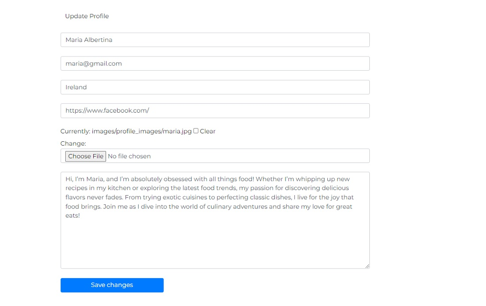

# The World of Flavors

**The World of Flavors** is a food recipe website created as the final project for the CS50's Web Programming with Python and JavaScript course at Harvard. This website allows users to explore, share, and engage with a wide variety of recipes from different cuisines. Users can create profiles, post their own recipes, rate others, and leave comments. The project showcases the skills and knowledge acquired throughout the course, including Django, HTML, CSS, and JavaScript.

## Screenshot

<p align="center"></p>

## Video
Watch the video version of the project here: [here](https://youtu.be/sp2bXLRJLu0).

## Table of Contents

- [The World of Flavors](#the-world-of-flavors)
- [Screenshot](#screenshot)
- [Video](#video)
- [Distinctiveness and Complexity](#distinctiveness-and-complexity)
- [How to Run the Application](#how-to-run-the-application)
- [User Experience - UX](#user-experience---ux)
  - [User Stories](#user-stories)
- [Design](#design)
  - [Colours](#colours)
  - [Typography](#typography)
- [Search Engine Optimization (SEO)](#search-engine-optimization-seo)
- [Modules](#modules)
- [Features](#features)
- [Modules](#modules)
  - [Accounts App](#1-accounts-app)
  - [Recipes App Models](#recipes-app-models)
  - [Database Diagram](#database-diagram)
- [Database Diagram](#Database--Diagram)
- [Pages & Features](#pages--features)
  - [Landing Page](#landing-page)
  - [Home Page](#home-page)
    - [Home / Images Carousel](#home--images-carousel)
    - [Home / Popular Recipes](#home--popular-recipes)
    - [Home / Testimonials](#home--testimonials)
  - [All Recipes Page](#all-recipes-page)
    - [All Recipes Page / Search Bar](#all-recipes-page--search-bar)
    - [All Recipes Page / No Results Found](#all-recipes-page--no-results-found)
  - [About Page](#about-page)
  - [My Favourites Recipes](#my-favourites-recipes)
    - [Favourites Recipes / Empty](#favourites-recipes--empty)
    - [Favourites Recipes / Liked Recipes](#favourites-recipes--liked-recipes)
  - [Add New Recipe Page](#add-new-recipe-page)
  - [Private User Profile](#private-user-profile)
    - [Private User Profile / Editing](#private-user-profile--editing)
  - [Public User Profile](#public-user-profile)
  - [Recipe Page](#recipe-page)
    - [Recipe Page / Image](#recipe-page--image)
    - [Recipe Page / Recipe Details](#recipe-page--recipe-details)
    - [Recipe Page / Recipe Details (Rating and Comments)](#recipe-page--recipe-details-rating-and-comments)
    - [Recipe Page / Recipe Rating](#recipe-page--recipe-rating)
    - [Recipe Page / Recipe Rated](#recipe-page--recipe-rated)
    - [Recipe Page / Recipe Already Rated](#recipe-page--recipe-already-rated)
    - [Recipe Page / Recipe Comments](#recipe-page--recipe-comments)
    - [Recipe Page / Recipe Comment Added](#recipe-page--recipe-comment-added)
    - [Recipe Page / Edit or Delete Comment](#recipe-page--edit-or-delete-comment)
    - [Recipe Page / Delete Comment Modal](#recipe-page--delete-comment-modal)
    - [Recipe Page / Edit or Delete Recipe](#recipe-page--edit-or-delete-recipe)
    - [Recipe Page / Delete Recipe Modal](#recipe-page--delete-recipe-modal)
  - [Edit Recipe Page](#edit-recipe-page)
  - [Edit Comment Page](#edit-comment-page)
  - [Register Page](#register-page)
  - [Login Page](#login-page)
  - [Navbar](#navbar)
    - [Navbar Links](#navbar-links)
  - [Footer](#footer)
  - [Messages and Interaction With Users](#messages-and-interaction-with-users)
  - [Admin Panel / Superuser](#admin-panel--superuser)
- [Website Responsiveness](#website-responsiveness)
  - [Website Responsiveness / Tablet](#tablet)
  - [Website Responsiveness / Mobile](#mobile)
- [Testing](#testing)
  - [Light House Results](#light-house-results)
  - [Manual Testing](#manual-testing)
  - [Test Rigor Testing](#test-rigor-testing)
- [Technologies Used](#technologies-used)
  - [Languages Used](#languages-used)
  - [Django Packages](#django-packages)
  - [Frameworks - Libraries - Programs Used](#frameworks---libraries---programs-used)
- [Credits](#credits)
- [Special Thanks](#special-thanks)

## Distinctiveness and Complexity
World of Flavors is my final project after several months of learning and improving my skills in Django, JavaScript, HTML, CSS, and more in the world of web development. I decided to build a food recipe website because I thought it would be a fun and challenging project. This project is a recipe management system with features like user authentication, posting recipes, liking and unliking recipes, rating them, and leaving comments. The complexity of the project comes from its detailed user profile management, a wide range of recipe categories, and dynamic content display. The site is designed to be responsive, providing a smooth experience on any device. Additionally, Django’s custom user models and a comprehensive admin panel for managing content further add to its complexity.

Along the way, I faced challenges, particularly with building the views and passing data to the templates. I also ran into issues with the database, which required me to reset it and start posting recipes again. However, after dedicating a few weeks to the project, I was able to complete it. In my opinion, it is functioning well, and the performance is solid.

## How to Run the Application

1. **Clone the repository:**

    ```bash
    git clone https://github.com/me50/PedroCristo
    cd cs50sw_project_5_world_of_flavors
    ```

2. **Set up a virtual environment:**

    ```bash
    python -m venv env
    source env/bin/activate  
    ```

3. **Install dependencies:**

    ```bash
    pip install -r requirements.txt
    ```

4. **Apply database migrations:**

    ```bash
    python manage.py migrate
    ```

5. **Run the development server:**

    ```bash
    python manage.py runserver
    ```

6. **Access the application in your browser:**

    Navigate to [http://127.0.0.1:8000/](http://127.0.0.1:8000/)


## User Experience - UX

## User Stories

#### As a website user, I can:

1. Navigate around the site and easily view the desired content.
2. View a list of recipes and choose accordingly.
3. Search recipes to find specific recipes.
4. Click on a post to read the recipe details.
5. Register for an account to enjoy all the services offered to members.
6. View the number of likes on a recipe, thereby showing which is most popular.
7. View comments on recipes so that I can read other users' opinions.
8. View the rating on recipes given by other users.

#### As a logged-in website user, I can:

1. Like/Unlike recipes, marking the recipes I enjoyed.
2. View all the recipes I have liked on the My Favorites page.
3. View other users' profile pages.
4. Post a new Recipe.
5. Delete or Edit a recipe I posted.
6. Comment on recipes and give my opinion about the posts.
7. Delete and edit my previous comments.
8. Manage my profile by updating my details and user image.
9. Rate a recipe.
10. Logout from the website.

#### As a website superuser, I can:

1. Create and publish new recipes.
2. Create new users, recipes, authors, and categories.
3. Delete users, recipes, authors, categories, and comments.
4. Create new categories for the website.
5. Approve users' comments.
6. Approve edited comments from users.
7. Choose the best user comments to be shown in testimonials by clicking the `in_active` box.
8. Choose a list of recipes to be shown on the Home Page by clicking the `in_featured` box.
9. Change website permissions for a user.

## Design

## Colours

<br>

- The colour scheme is designed to enhance readability and user experience. The primary background color is white, providing a clean and minimalistic look, while text appears in black for high contrast and legibility. For the navigation bar, a white background is used which transitions to a slightly darker shade of black when the user scrolls, creating a subtle effect. Icons, some buttons, and text are displayed using the interactive color (orange) to make them stand out and engage users.

- Here are the specific colors used in the design:
  - **White Color**: `rgb(247, 236, 236)`
  - **Light Grey Color**: `rgb(204, 194, 194)`
  - **Dark Black**: `rgb(37, 35, 35)`
  - **Light Black**: `rgb(70, 68, 68)`
  - **Interactive Color**: `rgb(255, 166, 0)`
  - **Error Red Color**: `rgb(230, 82, 82)`

## Typography

- The Montserrat font is used as the main font for the whole project, and the Kaushan font is used to display the recipe names.

## Search Engine Optimization (SEO)

```
<!-- SEO -->
<meta name="description" content="Explore a world of diverse and delicious recipes with World of Flavors. From international dishes to local favorites, discover and rate recipes for every taste. Join our community to share culinary experiences and enjoy new flavor adventures. Free sign-up and special features for all users.">
<meta name="keywords" content="recipes, recipe ratings, global cuisines, cooking inspiration, flavor adventures, culinary reviews, food enthusiasts, international recipes, user reviews, cooking community, diverse dishes, recipe sharing, flavor exploration, taste experiences">
```

To help people find World of Flavors more easily once it's deployed live, I have added important SEO practices, including meta tags in the `<head>`section of the project. This will ensure that search engines can find and display our site in search results.

## Features

- **User Authentication**: Secure user login and registration system.
- **User Profiles**: Users can create and customize their profiles, including a profile picture, location, and bio.
- **Recipe Management**: Users can add, edit, and delete recipes, which are categorized by main category, origin, and difficulty level.
- **Comment System**: Users can leave comments on recipes, which are moderated for approval.
- **Ratings and Likes**: Users can rate recipes and like/unlike them.
- **Responsive Design**: The website is fully responsive, ensuring a seamless experience on all devices.

## Modules

### 1. **Accounts App**

- **CustomUser Model**: Extends Django's default `AbstractUser` to allow for further customization in the future.
- **UserProfile Model**: Stores additional user information such as a profile picture, social media links, and bio.

```python
class UserProfile(models.Model):
    user = models.OneToOneField(settings.AUTH_USER_MODEL, on_delete=models.CASCADE)
    user_name = models.CharField(max_length=30, blank=True)
    location = models.CharField(max_length=30, blank=True)
    user_image = models.ImageField(upload_to='images/profile_images/', blank=True, null=True)
    user_social_media = models.URLField(max_length=200, blank=True)
    bio = models.TextField(max_length=500, blank=True)
```

### Recipes App Models

- **MainCategory Model**: Represents the primary categories that recipes can be classified under.

- **OriginCategory Model**: Represents the origin or type of cuisine for the recipe.

- **DifficultyLevelCategory Model**: Represents the difficulty level required to prepare the recipe.

- **Recipe Model**: Manages the core content of the site — the recipes, including title, ingredients, preparation steps, and images.

- **Rating Model**: Allows users to rate recipes and ensures that each user can only rate a recipe once.

- **Comment Model**: Handles user comments on recipes, with moderation controls (`is_approved`, `is_active`).

```python
class Recipe(models.Model):
    title = models.CharField(max_length=100, blank=False)
    sub_title = models.CharField(max_length=255, blank=False)
    ingredients = models.TextField()
    how_to_prepare = models.TextField()
    main_category = models.ForeignKey('MainCategory', on_delete=models.CASCADE)
    origin_category = models.ForeignKey('OriginCategory', on_delete=models.CASCADE, blank=True, null=True)
    difficulty_level = models.ForeignKey('DifficultyLevelCategory', on_delete=models.CASCADE, blank=True, null=True)
    time_to_prepare = models.IntegerField(default=0)
    author = models.ForeignKey(settings.AUTH_USER_MODEL, on_delete=models.CASCADE)
    is_featured = models.BooleanField(default=False)
    is_active = models.BooleanField(default=True)
    timestamp = models.DateTimeField(auto_now_add=True)
    comment_count = models.PositiveIntegerField(default=0)
    likes = models.ManyToManyField(settings.AUTH_USER_MODEL, related_name='liked_recipes', blank=True)
    small_image = models.ImageField(upload_to='images/small/posts/', blank=True, null=True)
    large_image = models.ImageField(upload_to='images/large/posts/', blank=True, null=True)
```

### Database Diagram


## Pages & Featues

### Landing Page


- The landing page is the first point of contact with the website. On this page, users see a looping video in the background, along with a title. There are also buttons for social media and a button that, when clicked, directs the user to the home page of the website.

### Home Page

#### Home / Images Carousel


- At the top of the home page, users can see an image carousel with 3 images sliding to the right. These images feature a food theme and include some content about the website's purpose.

#### Home / Popular Recipes


- Scrolling down the home page, users can see a section featuring popular recipes. This section displays 6 recipes chosen by the superuser by selecting the featured box in the admin panel.

#### Home / Testimonials


- Continuing to scroll down the home page, users can see a section featuring popular comments from other users. This section displays 4 comments chosen by the superuser by selecting the active box in the admin panel. Users can also be redirected to the related recipe by clicking the recipe name at the bottom of the testimonials carousel.

### All Recipes Page


- On the All Recipes page, users have access to view all the recipes posted on the website. They can also navigate through the pages using the pagination buttons located at the bottom right of the page.

#### All Recipes Page / Search Bar


- On the All Recipes page, users have access to a search bar at the top of the page. By clicking on the magnifying glass icon, users can search for recipes by "Main Category," "Origin Category," and "Difficulty Level."

#### All Recipes Page / No Results Found


- If no recipes are found based on the search criteria, a message will be displayed to the user suggesting they try a different search.

### About Page


- On the About page, users can learn more about the website, including its mission, vision, and the team behind it. This page provides information on the purpose of the site and its values, offering users a deeper understanding of the project.

### My Favourites Recipes

#### Favourites Recipes / Empty


- If users have not liked any recipes through the website, this page will display a message indicating that no favourites have been added yet.

#### Favourites Recipes / Liked Recipes


- On this page, logged-in users can view all the recipes they have liked throughout the website by clicking the "like" button on any recipe.

### Add New Recipe Page


- On this page, logged-in users can add a new recipe by filling out the form with details such as the title, subtitle, ingredients, preparation steps, main category, origin category, difficulty level, time to prepare, and by uploading images.

### Private User Profile


- On this page, logged-in users can view and manage their personal profile details, including their username, location, profile image, and social media links. Clicking on the "Edit Profile" button will open an accordion that displays the editing form.

#### Private User Profile / Editing



- On this form, logged-in users can edit their personal profile details, such as updating their username, location, profile image, and social media link.

### Public User Profile


- On this page, users can view the public profile of other users, including their username, location, profile image, and social media link.

### Recipe Page

#### Recipe Page / Image


- At the top of the Recipe page, users can see an image of the recipe along with details such as the recipe's origin, difficulty level, type of dish, preparation time, number of likes, and the rating from other users.

#### Recipe Page / Recipe Details


- Scrolling down, users can see the recipe title, a brief introduction, the list of ingredients, and the step-by-step preparation instructions.

#### Recipe Page / Recipe Details (Rating and Comments)


- In this section of the Recipe Page, users can see information about who posted the recipe and when, along with the number of likes. Users can like or unlike the recipe and rate it by clicking the "Rate Recipe" button. They can also add a comment on the recipe by clicking the "Add Comment" button. At the bottom right of the page, all user-added comments will be displayed.

#### Recipe Page / Recipe Rating


- When a user clicks on the "Rate Recipe" button, a light modal will open at the top of the page, allowing users to rate the recipe from 1 to 5 stars.

#### Recipe Page / Recipe Rated


- After rating a recipe, the user will see a "Thank you" alert at the top of the page and can also view the updated product rating.

#### Recipe Page / Recipe Already Rated


- After rating a recipe, the "Rate Recipe" button will be replaced with the message "You have already rated this recipe." Each user can only rate a recipe once.

#### Recipe Page / Recipe Comments


- When a user clicks on the "Add Comment" button, a light modal will open at the top of the page, allowing users to add a comment to the recipe.

#### Recipe Page / Recipe Comment Added


- After submitting the comment, the user will see an alert at the top of the page. The comment will not be displayed immediately as it must be approved by the superuser before appearing on the website.

#### Recipe Page / Edit or Delete Comment


- If the user is the author of the comment or a superuser, three dots will appear next to the comment. Clicking on these dots will open a menu with options to "Edit" or "Delete" the comment.

#### Recipe Page / Delete Comment Modal


- After clicking the "Delete Comment" button, a light modal window will appear on the screen, asking if the user is sure they want to delete the comment. If the user confirms, the comment will be permanently removed.

#### Recipe Page / Edit or Delete Recipe


- If the user is the author of the recipe, three dots will appear next to the comment. Clicking on these dots will open a menu with options to "Edit" or "Delete" the recipe.

#### Recipe Page / Delete Recipe Modal


- After clicking the "Delete Recipe" button, a light modal window will appear on the screen, asking if the user is sure they want to delete the recipe. If the user confirms, the recipe will be permanently removed.

### Edit Recipe Page


- After the user who posted the recipe clicks on the "Edit" button on the Recipe Page, they will be redirected to the Edit Recipe Page, where they can make changes to the recipe.

### Edit Comment Page


- After the user who posted the comment clicks on the "Edit Comment" button on the Recipe Page, they will be redirected to the Edit Comment Page, where they can make changes to the comment. Once the comment is submitted, it will not be displayed immediately as it needs to be reviewed and approved by the superuser.

### Register Page


- On this page, new users can create an account on the World of Flavors website by filling out the registration form with their details.

### Login Page


- On this page, existing users can log in by entering their username and password.

### Navbar


- The website navbar is fully responsive, allowing users to easily navigate to different pages within the app.

#### Navbar Links

- Intro Page
- Home Page
- All Recipes Page
- About Page
- My Favorites Page
- Add Recipe Page
- Private User Profile Page
- Login Page
- Registration Page
- Logout Page
- Go to Home Page (Clicking on the Website Logo)

### Footer


- The website footer provides users with information about the World of Flavors, including contact details and social media links. Users can also subscribe to the newsletter by submitting the form available in this section.

### Messages and Interaction With Users


- The project includes interactive messages designed to enhance navigation and improve user experience. These messages provide feedback and alerts, making interactions more intuitive and informative.

### Admin Panel / Superuser


- In the Admin Panel, the admin or superuser has full CRUD (Create, Read, Update, Delete) access to manage the following:

* Users
* Recipes
* Comments
* Main Categories
* Difficulty Level Categories
* Origin Categories
* Ratings

## Website Responsiveness

### The website is designed to be fully responsive across a variety of devices, including desktops, tablets, and mobile phones. This ensures that users have an optimal viewing experience no matter what device they use. Here’s how the website adapts to different screen sizes:

### Tablet

- For tablet users, the website adjusts to a more compact layout. The navigation bar switches to a more mobile-friendly format, and the content is presented in a single-column format to fit the narrower screen width. Interactive elements and images are resized to ensure they remain functional and visually appealing.

  #### Tablet / Portrait orientaion
  Watch the Tablet version of the project here: [here](https://youtu.be/G2vKyZ09HZ8).
  
  #### Tablet / Lanscape orientaion
  Watch the Tablet version of the project here: [here](https://youtu.be/5CPDYQXdriU).
  

### Mobile

- For mobile users, the website adapts to an even more compact layout. The navigation bar becomes a collapsible menu for easier access, and content is streamlined into a single-column view to accommodate the smaller screen size. Interactive elements and images are resized and optimized to ensure they remain functional and visually appealing on the reduced display
  
  #### Mobile / Portrait orientaion</h2>
  Watch the Mobile version of the project here: [here](https://youtu.be/UBki0s4y0Ps).
 

## Testing

### Continuous Testing and Quality Checking

Throughout the development of this project, rigorous testing was an integral part of the process to ensure the website's functionality, responsiveness, and overall user experience met the project's goals.

#### Regular View Testing

Each view of the website was subjected to regular and systematic testing. This included checking the layout, design elements, and interactive features to ensure they performed consistently across different devices and browsers. Special attention was given to ensuring that the website maintained its integrity and visual appeal on desktops, tablets, and mobile devices.

#### Debugging and Issue Resolution

Whenever the outcome of a test did not align with the expected results, immediate debugging was initiated. This involved identifying the root cause of the issue, whether it was related to front-end design, back-end logic, or cross-browser compatibility (Google Chrome & Microsoft Edge).

### Light House Results


- The website's performance was evaluated using Chrome's Lighthouse tool, which provides comprehensive audits on various aspects of web quality.

### Manual Testing

- **Signup, Login, and Logout:**

  - The signup, login, and logout systems are functioning correctly. Each process displays the appropriate interactive messages to users, ensuring a seamless authentication experience.

- **Profile Page:**

  - The profile page operates as intended. Users can update their information, and an interactive message confirms when the update is successful.

- **Internal Links:**

  - All internal links navigate users to the correct pages within the website, ensuring accurate and efficient navigation.

- **External Links:**

  - All external links correctly direct users to the appropriate social media pages, opening in a new browser tab as expected.

- **Categories Search Bar:**

  - The categories search bar effectively filters recipes by category without any issues, providing accurate results.

- **Recipe Management:**

    - **Add, Edit, and Delete:** 

         - The functionality to add, edit, and delete recipes is working perfectly. Users and admins can manage recipes as needed.
         - Users can add, edit, and delete recipes successfully. The recipe management features operate without any issues.

- **Comment Management:**

    - **Add, Edit, and Delete:**

         - Users can successfully add, edit, and delete comments on recipes. The comment management features operate without any issues.

- **Like/Unlike Recipes:**

  - The like/unlike functionality for recipes is working as expected. Users can easily like or unlike recipes, with the changes reflected immediately.

- **Recipe Rating:**

  - The rating system for recipes is functioning correctly. Users can submit ratings, and the average rating for each recipe updates accordingly.

- **Bootstrap Modal for Recipe Deletion:**

  - The Bootstrap modal successfully prompts users to confirm if they want to delete a recipe. After the deletion action is completed, an interactive message appears at the top right of the page to confirm the successful removal.

- **Bootstrap Accordion for Recipe Actions:**
  - The Bootstrap accordion correctly displays the "Delete" and "Edit" buttons, allowing users to manage their recipes efficiently.

#### Test Rigor Testing


- During the testing with **Test Rigor**, I ran a series of thorough tests on the application. Here’s a summary of the successful results from testing different sections:


## Technologies Used

### Languages Used

- [HTML 5](https://en.wikipedia.org/wiki/HTML/)
- [CSS 3](https://en.wikipedia.org/wiki/CSS)
- [JavaScript](https://www.javascript.com/)
- [Django](https://www.python.org/)
- [Python](https://www.djangoproject.com/)

### Django Packages

- **[django-summernote](https://django-summernote.readthedocs.io/en/latest/)**

  - Enables rich text formatting features such as headings, lists, and media embeds directly within the Django admin interface, improving the ease of content creation.

- **[django-widget-tweaks](https://pypi.org/project/django-widget-tweaks/)**

  - Provides template tags and filters for adjusting form field attributes, making it simpler to style and format forms without altering form definitions in your Python code.

- **[pillow](https://pypi.org/project/Pillow/)**
  - Essential for handling image uploads and processing tasks like resizing and cropping images within Django applications.

### Frameworks - Libraries - Programs Used

- [Bootstrap](https://getbootstrap.com/)<br>
  Was used to style the website, add responsiveness and interactivity
- [Jquery](https://jquery.com/)<br>
  Some the scripts were written using jquery library
- [Git](https://git-scm.com/)<br>
  Git was used for version control by utilizing the Gitpod terminal to commit to Git and push to GitHub
- [GitHub](https://github.com/)<br>
  GitHub is used to store the project's code after being pushed from Git
- [VSCode](https://code.visualstudio.com/)<br>
  VSCode was used to create and edit the website
- [Fontawesome](https://fontawesome.com/)<br>
  To add icons to the website
- [Google Chrome Dev Tools](https://developer.chrome.com/docs/devtools/)<br>
  To check App responsiveness and debugging
- [Google Fonts](https://fonts.google.com/)<br>
  To add the 2 fonts that were used throughout the project
- [Dbdiagram](https://dbdiagram.io/d)<br>
  To build the projects Database Diagram
- [CANVA](https://www.canva.com/)<br>
  To build the favicon and edit images for the project
- [Coolors](https://coolors.co/)<br>
  To build the colour palette of the project
- [Mailchimp](https://mailchimp.com/)<br>
  Used to collect user emails for newsletter purposes.
- [testRigor](https://testrigor.com/)<br>
  Used to to test the aplication.

## Credits
- All food recipes were taken from [BBC Goodfood](https://www.bbcgoodfood.com/recipes)
- The video used as a background on the Landing Page were taken from [Pexels](https://www.pexels.com/)
- The images were taken from [Unsplash](https://unsplash.com/)
- The World of Flavors favicon is designed and built by me.

## Special Thanks
Special thanks to the entire CS50w course team and Brian Yu for the excellent explanations throughout the videos.
